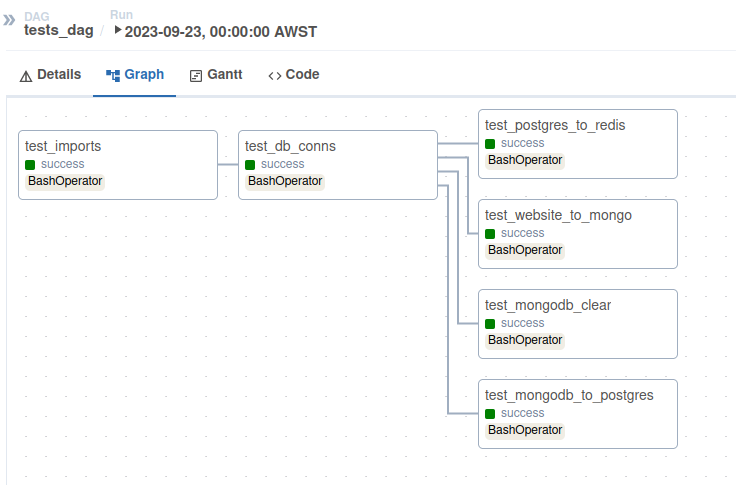

# Introduction

This project retrieves supermarket pricing and product specials data on a weekly basis and loads it into a data mart. Really I just wanted to have fun while building something with the following technologies:

* Apache Airflow
* Docker
* Python
* MongoDB
* PostgreSQL
* dbt
* Redis

To keep costs down I have chosen a dockerised approach rather than using cloud services. This project is intended to be run as a development environment amd further work is needed to move to producton. For example, it may be worth switching to Azure Managed Airflow rather than running from a docker container.

There is no API available on the Coles (supermarket) website so web scraping is necessary for this project. Please see the "A Note On Ethical Web Scraping" section below. 

Python tests for scripts are available in the dags/dag_scripts/tests folder

# Data Pipeline Architecture

# PostgreSQL / dbt Data Model

# Airflow DAGs
Main DAG:

Tests DAG:

# A Note On Ethical Web Scraping
As part of ethical web scraping practices please note the following:

* Coles is the sole owner of all data used in this project. With the exception of a small single week sample dataset to illustrate the data in each PostgreSQL table, I have not included week-on-week pricing data for further analysis. Data collected in this project is strictly for a fun hobby project and is not to be used for commercial purposes. By using this git repository you must agree not to use collected data for commercial purposes. 
* I consulted the Coles robots.txt page before starting this project. The pages used for web scraping are not included in the robots.txt page.
* I have limited the scope of this project to just retrieve data for fruits and vegetables - about 15 requests to the Coles website per week, on par with what a human might request. The original scope of this project included all products on the entire Coles website but was trimmed to reduce the number of requests to the Coles web server.
* I have added a random sleep statement of 30-80 seconds between requests as a courtesty to avoid overloading the Coles web server.

